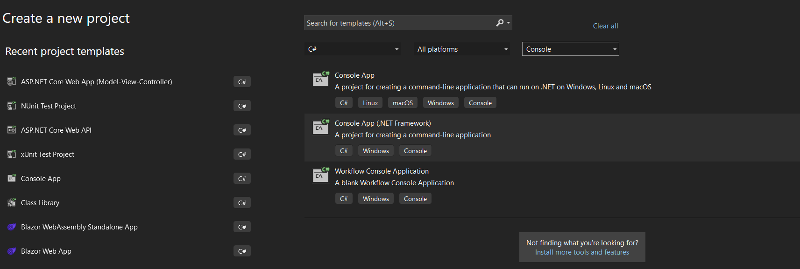
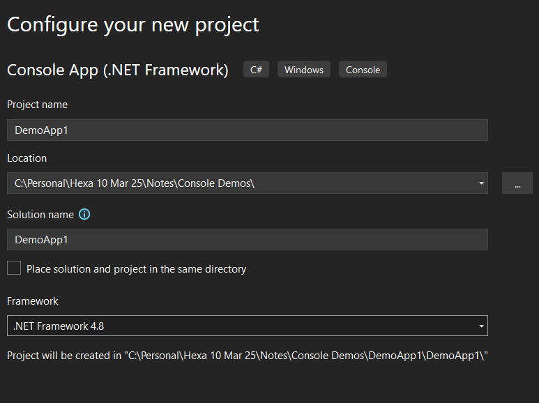
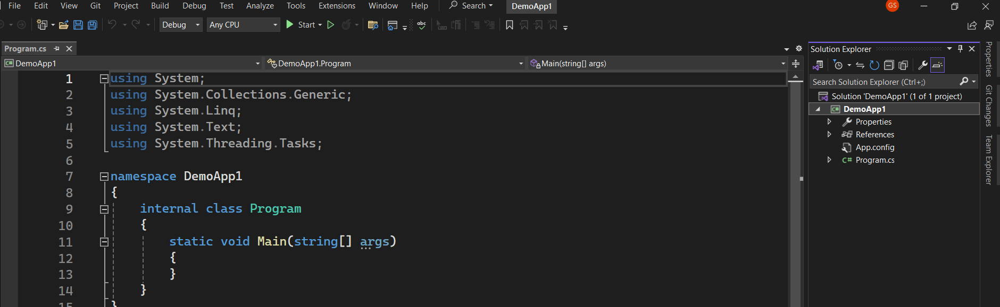
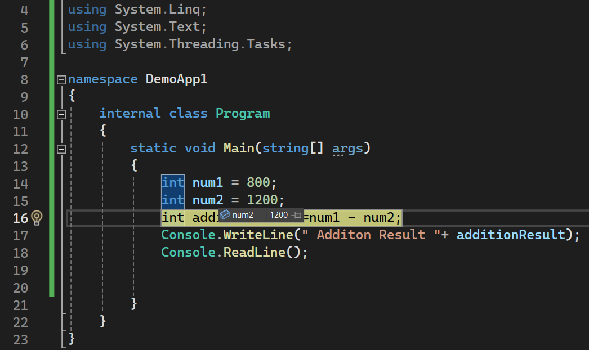

Open Vs 2022

Create New Project





Create




```cs
 static void Main(string[] args)
 {
     int num1 = 800;
     int num2 = 1200;
     int additionResult=num1 + num2;
     //Console.WriteLine("Num1="+num1);
     //Console.WriteLine("Num2="+num2);
     //Console.WriteLine("Additon Result "+ additionResult);

     Console.WriteLine("Num1 ="+num1+"\nNum2 = "+num2+"\nAddition Result = "+additionResult);

     //String interpolation
     Console.WriteLine($"Num1={num1}\nNum2 = {num2}\nAdditionResult= {additionResult}");

     Console.ReadLine();
 }
 ```

 # Take an input from the user

 ```cs
    static void Main(string[] args)
    {
        int num1, num2, additionResult;
        Console.WriteLine("Enter first integer value");
        num1 = Convert.ToInt32(Console.ReadLine());
        Console.WriteLine("Enter Second integer value");
        num2 = Convert.ToInt32(Console.ReadLine());
        additionResult = num1 + num2;
        //String interpolation
        Console.WriteLine($"Num1={num1}\nNum2 = {num2}\nAdditionResult= {additionResult}");
        Console.ReadLine();
    }

 ```

 # Example for all type of variable

 ```cs
using System;
using System.Collections.Generic;
using System.Linq;
using System.Text;
using System.Threading.Tasks;

namespace DemoApp1
{
    internal class Program
    {
        static void Main(string[] args)
        {
           // int numberOfBooks;
           // Console.WriteLine("Enter the number of Books");
           // numberOfBooks = Convert.ToInt32(Console.ReadLine());
           // double priceOfBook;
           // Console.WriteLine("Enter the Price of The Books");
           // priceOfBook = Convert.ToDouble(Console.ReadLine());

           // bool isBookAvailable;
           // Console.WriteLine("Is that Book Available");
           // isBookAvailable=Convert.ToBoolean(Console.ReadLine());
           // float temperatureInCelcius;
           // Console.WriteLine("Enter the temperature in celcius");
           //// temperatureInCelcius = Convert.ToSingle(Console.ReadLine());
           // temperatureInCelcius = float.Parse(Console.ReadLine());

           // char section;
           // Console.WriteLine("Enter the Section of class");
           // section = Convert.ToChar(Console.ReadLine());

           // string studentName;
           // Console.WriteLine("Enter the Name of the Student");
           // studentName = Console.ReadLine();

           // long populationOfCity;
           // Console.WriteLine("Enter the Population of Your City");
           // populationOfCity = Convert.ToInt64(Console.ReadLine());

           // decimal bankBalance;
           // Console.WriteLine("Enter your Bank Balance");
           // bankBalance = decimal.Parse(Console.ReadLine());
           // bankBalance = Convert.ToDecimal(Console.ReadLine());

            DateTime currentDate = DateTime.Now;
            DateTime dateOfBirth;
            Console.WriteLine("Enter the Date of Birth");
            dateOfBirth = Convert.ToDateTime(Console.ReadLine());

            object randomData = "Sample Data";

            Console.WriteLine("Data \n ****************************\n");

            //Console.WriteLine($"NumberOfBooks = {numberOfBooks}\n Price of the Book={priceOfBook}");
            //Console.WriteLine($"TemperaturInCelcius = {temperatureInCelcius} \n Section= {section} ");
            //Console.WriteLine($"StudentName = {studentName}\n Population ={populationOfCity} \nBank Balance={bankBalance}");
            //Console.WriteLine($" today' Date= {currentDate} \n Date Of Birth={dateOfBirth} \n randomData= {randomData}");
            Console.WriteLine($"Date without time = {dateOfBirth.ToString("yyyy-MM-dd")}");
            Console.WriteLine($"Date without time = {dateOfBirth.ToString("MM/dd/yyyy")}");
            Console.WriteLine($"Date without time = {dateOfBirth.ToString("dd/MM/yyyy")}");
            Console.ReadLine();
        }
    }
}
```

# Array
```cs
  int[] myArray = new int[5];
  myArray[0] = 5465;
  myArray[2] = 900;
  Console.WriteLine("The length of myarray is  "+myArray.Length);

  for (int i = 0; i < myArray.Length; i++) {
      Console.WriteLine(myArray[i]);
  }
  Console.ReadLine();
```

```cs
  static void Main(string[] args)
  {
      //declaratio of an array
      int[] myArray = new int[5];
      //declaration and initialization
      int[] myArray = new int[] { 34, 678, 678, 345, 245, 788 };
     
      Console.WriteLine("The length of myarray is  "+myArray.Length);

      for (int i = 0; i < myArray.Length; i++) {
          Console.WriteLine(myArray[i]);
      }
      Console.ReadLine();
  }
```

```cs
  static void Main(string[] args)
  {
      
      int[] myArray = new int[5];
      Console.WriteLine($"Enter {myArray.Length} integer values ");
      for (int i = 0; i < myArray.Length; i++)
      {
          myArray[i] = int.Parse( Console.ReadLine() );

      }

      Console.WriteLine("\nThe Entered array elements are\n");

      for (int i = 0; i < myArray.Length; i++) {
          Console.WriteLine(myArray[i]);
      }
      Console.ReadLine();
  }
```

```cs
 static void Main(string[] args)
 {
     
     int[] myArray = new int[5];
     Console.WriteLine($"Enter {myArray.Length} integer values ");
     for (int i = 0; i < myArray.Length; i++)
     {
         myArray[i] = int.Parse( Console.ReadLine() );

     }

     Console.WriteLine("\nThe Entered array elements are\n");

  foreach (int i in myArray)
     {
         Console.WriteLine(i);
     }
     Console.ReadLine();
 }
 ```

 # example for implicitly typed variable , Difference between  int.parse, int.tryParse(),Convert.toint32()

 ```cs
 
     //implicitly typed variable 
     var num1 = "123"; // string
     var num2 = 900; // int
     var num3 = 945.767;
     Console.WriteLine($" Typeof num1= {num1.GetType()} \n num2={num2.GetType()} \n Num3 ={num3.GetType()} ");

     if (int.TryParse(num1, out int result1))
     {
         Console.WriteLine($"after convertion result1 ={result1}");
     }else
     {
         Console.WriteLine("Invalid format");
     }


     // int.parse, int.tryparse and convert.toint

     string number1;
     int result= int.Parse(number1 );  //error

     int result2 = Convert.ToInt32(number1);

              
 ```

```cs
    //int[,] myArray = new int[2,3] {{ 1, 2, 3 }, { 6, 7, 8 } };

    //for (int i = 0; i <2; i++)
    //{
    //    for (int j = 0; j < 3; j++)
    //    {
    //        Console.Write($"{myArray[i,j]}\t");
    //    }
    //    Console.WriteLine();
    //}
    // Declare the array of four elements:
    int[][] jaggedArray = new int[4][];

    // Initialize the elements:
    jaggedArray[0] = new int[2] { 7, 9 };
    jaggedArray[1] = new int[4] { 12, 42, 26, 38 };
    jaggedArray[2] = new int[6] { 3, 5, 7, 9, 11, 13 };
    jaggedArray[3] = new int[3] { 4, 6, 8 };

    // Display the array elements:
    for (int i = 0; i < jaggedArray.Length; i++)
    {
        System.Console.Write("Element({0}): ", i + 1);

        for (int j = 0; j < jaggedArray[i].Length; j++)
        {
            System.Console.Write(jaggedArray[i][j] + "\t");
        }
        System.Console.WriteLine();
    }
    Console.ReadLine();
       
}
```

# Example for Jagged array
```cs
    Console.WriteLine("Enter the Number of classes");
    int numberOfClass=Convert.ToInt32(Console.ReadLine());

    string[][] school=new string[numberOfClass][];
    for(int i = 0; i < numberOfClass; i++)
    {
        Console.WriteLine($"Enter the number of student for class {i+1} ");
        int numOfStudents=Convert.ToInt32(Console.ReadLine());
        school[i]=new string[numOfStudents];
        for (int j = 0; j < numOfStudents; j++)
        {
            Console.WriteLine($"Enter the name of the students {j+1} in class {i+1}");
            school[i][j] = Console.ReadLine();
        }
    }
    Console.WriteLine("\n ********** Student List *********\n");
    for (int i = 0; i < school.Length; i++)
    {
        Console.WriteLine($"\n class {i+1}: ");
        for (int j = 0; j < school[i].Length; j++)
        {
            Console.WriteLine($"-{school[i][j]}");
        }
    }
    Console.ReadLine();
       
}

```

# exmaple for strructure
```cs
using System;
using System.Collections.Generic;
using System.Linq;
using System.Runtime.Versioning;
using System.Text;
using System.Threading.Tasks;

namespace DemoApp1
{
    struct Book
    {
        public string title;
        public string author;
        public decimal price;
        public Book(string title1, string author1, decimal price1)
        {
            title = title1;
            author = author1;
            price = price1;
        }

        public void display()
        {
            Console.WriteLine("\n ************ book1 Info *******\n");
            Console.WriteLine($"{title}\n{author}\n{price}");
           
        }
    }

    internal class Program
    {
        static void Main(string[] args)
        {
            Book book1;
            book1.title = "React ";
            book1.author = "Geetha";
            book1.price = 678.34M;

            Book book2 = new Book();
            book2.title = "Azure ";
            book2.author = "Geetha";
            book2.price = 5678.34M;

            Book book3 = new Book("Angular", "Fransy", 6787);


            book1.display();
            book2.display();
            book3.display();
            Console.ReadLine();

        }
    }
}

```